  

   

  <strong>AI engineer / researcher building production ML and multi-agent systems in investment management.</strong>

   

  Context engineering · agent orchestration · retrieval · evaluations · product delivery

    

  <a href="https://delapan.ai/">delapan.ai</a>
  &nbsp;·&nbsp;
  <a href="https://www.linkedin.com/in/suherli/">LinkedIn</a>
  &nbsp;·&nbsp;
  <a href="mailto:anthonysuherli@gmail.com">Email</a>

### I build the layer between a model and a useful decision.

My work sits where research meets production: turning ambiguous problems into inspectable agent workflows, durable context, measurable evaluations, and software that people can actually operate.

Right now I am deep in the **context engineering** rabbit hole—how agents acquire the right evidence, share state without drowning in it, and know when they have enough coverage to act.

> **Working thesis:** reliable agents are less about one perfect prompt and more about explicit context boundaries, orchestration, and feedback loops that make failure legible.

### Featured projects

<table>
  <tr>
    <td width="50%" valign="top">
      <h3>Misconception Studio</h3>
      A teacher-controlled active evidence loop for formative assessment: test candidate reasoning patterns against matching and conflicting observations, abstain when evidence is weak, then propose a teacher-reviewed follow-up.
        
      <code>in development</code> <code>OpenAI Build Week</code> <code>education</code> <code>evidence loops</code>
    </td>
    <td width="50%" valign="top">
      <h3><a href="https://github.com/anthonysuherli/hunter8">hunter8 ↗</a></h3>
      A Playwright CLI that fills job applications from an Excel tracker and pauses for human review when an ATS asks for open-ended judgment instead of blindly submitting.
        
      <code>Playwright</code> <code>human-in-the-loop</code> <code>automation</code> <code>Python</code>
    </td>
  </tr>
  <tr>
    <td width="50%" valign="top">
      <h3><a href="https://github.com/anthonysuherli/person8-gc">person8 ↗</a></h3>
      A cited-answer agent that plans, searches over Elastic, synthesizes evidence, and returns a concrete next step—built for the Google Cloud Rapid Agent hackathon.
        
      <code>agents</code> <code>Elastic</code> <code>Google Cloud</code> <code>citations</code>
    </td>
    <td width="50%" valign="top">
      <h3><a href="https://github.com/anthonysuherli/8queens">queens8 ↗</a></h3>
      A deep-research agent society where planners, researchers, a critic, and a synthesizer coordinate through a shared, coverage-banded findings brain—benchmarked against a single-agent baseline.
        
      <code>multi-agent</code> <code>knowledge graph</code> <code>Qwen</code> <code>evals</code>
    </td>
  </tr>
  <tr>
    <td colspan="2" valign="top">
      <h3><a href="https://delapan.ai/">delapan ↗</a></h3>
      Context-aware research infrastructure: plan → search → crawl → extract → merge, persist structured findings as durable memory, then serve that context to AI tools over MCP.
        
      <code>research</code> <code>retrieval</code> <code>knowledge base</code> <code>MCP</code>
    </td>
  </tr>
</table>

### What the public graph does not show

  

  
<strong>How I handle private contribution context</strong>

   
  This snapshot covers July 2025–July 2026. It counts commits authored by this account in accessible private repositories, then groups commit subjects into broad, overlapping engineering themes. Repository names, organizations, links, and commit messages are intentionally excluded.

### The toolkit

**Core:** Python · TypeScript · SQL · FastAPI · Pydantic · SQLite / pgvector · Elasticsearch 
**AI systems:** multi-agent orchestration · MCP · RAG / retrieval · knowledge graphs · LLM evaluations 
**Delivery:** AWS · Google Cloud · Docker · CI/CD · product discovery

### Background

- AI / ML engineer and researcher since 2021.
- **M.S. Financial Engineering**, USC · **B.S. Electrical Engineering**, UW.
- I like systems with visible reasoning, explicit tradeoffs, and a short path from evidence to action.

   
  Always happy to compare notes on agents, context, and building the feedback loop around both.

